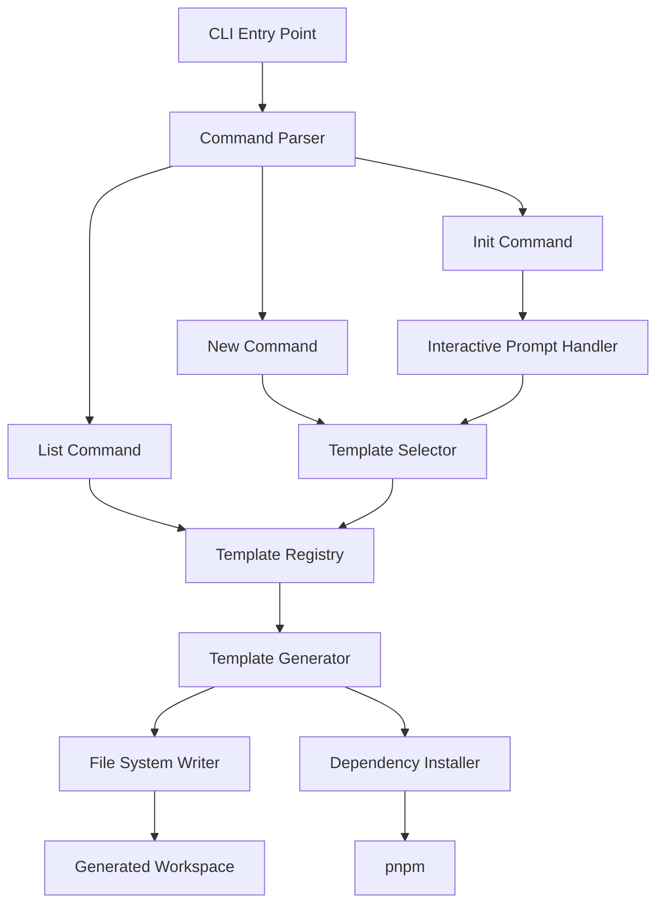

# Design Document

## Overview

SolAnchorGen is a Node.js-based CLI tool that generates Anchor program scaffolding for Solana development. The tool uses a template-based architecture where each template is a self-contained module with code generators, configuration options, and metadata. The CLI is built using Commander.js for command parsing and Inquirer.js for interactive prompts, with pnpm enforced as the package manager.

## Architecture

### High-Level Architecture



### Component Architecture

The system is organized into the following layers:

1. **CLI Layer**: Handles command-line interface, argument parsing, and user interaction
2. **Template Layer**: Manages template registry, selection, and metadata
3. **Generation Layer**: Orchestrates file generation, code transformation, and workspace setup
4. **File System Layer**: Handles file operations, directory creation, and file writing
5. **Package Management Layer**: Manages dependency installation using pnpm

## Components and Interfaces

### 1. CLI Entry Point (`src/index.ts`)

**Responsibility**: Application entry point that initializes the CLI and registers commands

**Interface**:
```typescript
// Main CLI initialization
function main(): Promise<void>

// Command registration
function registerCommands(program: Command): void
```

### 2. Command Parser (`src/cli/commander.ts`)

**Responsibility**: Configures Commander.js with all available commands and options

**Interface**:
```typescript
interface CommandConfig {
  name: string
  description: string
  options: CommandOption[]
  action: CommandAction
}

interface CommandOption {
  flags: string
  description: string
  defaultValue?: any
}

type CommandAction = (options: any) => Promise<void>

function createProgram(): Command
function addCommand(program: Command, config: CommandConfig): void
```

### 3. Init Command Handler (`src/commands/init.ts`)

**Responsibility**: Handles interactive project initialization with user prompts

**Interface**:
```typescript
interface InitOptions {
  // No options - fully interactive
}

interface InitPromptAnswers {
  projectName: string
  template: string
  customOptions: Record<string, any>
}

async function initCommand(options: InitOptions): Promise<void>
async function promptForProjectDetails(): Promise<InitPromptAnswers>
```

### 4. New Command Handler (`src/commands/new.ts`)

**Responsibility**: Handles direct template generation with command-line arguments

**Interface**:
```typescript
interface NewCommandOptions {
  template: string
  tokenDecimals?: number
  // Additional template-specific options
}

async function newCommand(
  projectName: string,
  options: NewCommandOptions
): Promise<void>
```

### 5. List Command Handler (`src/commands/list.ts`)

**Responsibility**: Displays all available templates with descriptions and options

**Interface**:
```typescript
interface TemplateListItem {
  name: string
  description: string
  options: TemplateOption[]
}

async function listCommand(): Promise<void>
function formatTemplateList(templates: TemplateListItem[]): string
```

### 6. Interactive Prompt Handler (`src/cli/prompts.ts`)

**Responsibility**: Manages Inquirer.js prompts for user input collection

**Interface**:
```typescript
interface PromptQuestion {
  type: string
  name: string
  message: string
  choices?: string[]
  validate?: (input: any) => boolean | string
}

async function promptUser(questions: PromptQuestion[]): Promise<any>
async function promptForTemplate(templates: Template[]): Promise<string>
async function promptForTemplateOptions(
  template: Template
): Promise<Record<string, any>>
```

### 7. Template Registry (`src/templates/registry.ts`)

**Responsibility**: Maintains catalog of available templates and their metadata

**Interface**:
```typescript
interface Template {
  id: string
  name: string
  description: string
  options: TemplateOption[]
  generator: TemplateGenerator
}

interface TemplateOption {
  name: string
  flag: string
  description: string
  type: 'string' | 'number' | 'boolean'
  defaultValue?: any
  validate?: (value: any) => boolean
}

class TemplateRegistry {
  registerTemplate(template: Template): void
  getTemplate(id: string): Template | undefined
  getAllTemplates(): Template[]
  getTemplateOptions(id: string): TemplateOption[]
}
```

### 8. Template Generator Interface (`src/templates/generator.ts`)

**Responsibility**: Defines the contract for template-specific code generation

**Interface**:
```typescript
interface GeneratorContext {
  projectName: string
  projectPath: string
  options: Record<string, any>
}

interface GeneratedFile {
  path: string
  content: string
}

interface TemplateGenerator {
  generate(context: GeneratorContext): Promise<GeneratedFile[]>
  getDependencies(context: GeneratorContext): Dependencies
  getDevDependencies(context: GeneratorContext): Dependencies
}

type Dependencies = Record<string, string>
```

### 9. Template Implementations

Each template implements the `TemplateGenerator` interface:

- `src/templates/nft-minting/generator.ts`
- `src/templates/staking/generator.ts`
- `src/templates/escrow/generator.ts`
- `src/templates/governance/generator.ts`
- `src/templates/marketplace/generator.ts`
- `src/templates/vault/generator.ts`

**Common Structure**:
```typescript
export class NftMintingGenerator implements TemplateGenerator {
  async generate(context: GeneratorContext): Promise<GeneratedFile[]> {
    return [
      this.generateProgramCode(context),
      this.generateTests(context),
      this.generateSdk(context),
      this.generateReadme(context),
    ]
  }

  getDependencies(context: GeneratorContext): Dependencies {
    return {
      '@coral-xyz/anchor': '^0.29.0',
      '@solana/web3.js': '^1.87.0',
    }
  }

  getDevDependencies(context: GeneratorContext): Dependencies {
    return {
      '@types/node': '^20.0.0',
      'typescript': '^5.0.0',
      'ts-node': '^10.9.0',
    }
  }

  private generateProgramCode(context: GeneratorContext): GeneratedFile
  private generateTests(context: GeneratorContext): GeneratedFile
  private generateSdk(context: GeneratorContext): GeneratedFile
  private generateReadme(context: GeneratorContext): GeneratedFile
}
```

### 10. Workspace Generator (`src/generator/workspace.ts`)

**Responsibility**: Orchestrates the complete workspace generation process

**Interface**:
```typescript
interface WorkspaceConfig {
  projectName: string
  projectPath: string
  template: Template
  options: Record<string, any>
}

class WorkspaceGenerator {
  async generate(config: WorkspaceConfig): Promise<void>
  private async createDirectoryStructure(path: string): Promise<void>
  private async generateFiles(files: GeneratedFile[]): Promise<void>
  private async generateAnchorConfig(config: WorkspaceConfig): Promise<void>
  private async generatePackageJson(config: WorkspaceConfig): Promise<void>
  private async installDependencies(path: string): Promise<void>
}
```

### 11. File System Writer (`src/utils/fs-writer.ts`)

**Responsibility**: Handles all file system operations with error handling

**Interface**:
```typescript
class FileSystemWriter {
  async createDirectory(path: string): Promise<void>
  async writeFile(path: string, content: string): Promise<void>
  async copyFile(source: string, destination: string): Promise<void>
  async pathExists(path: string): Promise<boolean>
  async ensureDirectory(path: string): Promise<void>
}
```

### 12. Package Manager (`src/utils/package-manager.ts`)

**Responsibility**: Manages pnpm operations and dependency installation

**Interface**:
```typescript
class PackageManager {
  async checkPnpmInstalled(): Promise<boolean>
  async installDependencies(projectPath: string): Promise<void>
  async addDependency(
    projectPath: string,
    packageName: string,
    version: string
  ): Promise<void>
  getInstallCommand(): string
}
```

### 13. Progress Reporter (`src/utils/progress.ts`)

**Responsibility**: Provides visual feedback during generation process

**Interface**:
```typescript
interface ProgressStep {
  message: string
  status: 'pending' | 'in-progress' | 'complete' | 'error'
}

class ProgressReporter {
  startStep(message: string): void
  completeStep(): void
  failStep(error: string): void
  displaySummary(projectName: string, nextSteps: string[]): void
}
```

### 14. Validator (`src/utils/validator.ts`)

**Responsibility**: Validates user inputs and configuration options

**Interface**:
```typescript
class Validator {
  validateProjectName(name: string): boolean | string
  validateTemplateName(name: string, registry: TemplateRegistry): boolean | string
  validateOptionValue(
    value: any,
    option: TemplateOption
  ): boolean | string
  validatePath(path: string): boolean | string
}
```

## Data Models

### Template Metadata

```typescript
interface TemplateMetadata {
  id: string
  name: string
  description: string
  version: string
  author: string
  tags: string[]
  options: TemplateOption[]
}
```

### Generated Workspace Structure

```
project-name/
├── programs/
│   └── project-name/
│       ├── src/
│       │   └── lib.rs
│       ├── Cargo.toml
│       └── Xargo.toml
├── tests/
│   └── project-name.ts
├── app/
│   └── src/
│       └── index.ts
├── migrations/
│   └── deploy.ts
├── Anchor.toml
├── package.json
├── pnpm-lock.yaml
├── tsconfig.json
└── README.md
```

### Package.json Structure

```json
{
  "name": "project-name",
  "version": "0.1.0",
  "description": "Generated Anchor program",
  "scripts": {
    "build": "anchor build",
    "test": "anchor test",
    "deploy": "anchor deploy"
  },
  "dependencies": {
    "@coral-xyz/anchor": "^0.29.0",
    "@solana/web3.js": "^1.87.0"
  },
  "devDependencies": {
    "@types/node": "^20.0.0",
    "typescript": "^5.0.0",
    "ts-node": "^10.9.0",
    "chai": "^4.3.0"
  }
}
```

### Anchor.toml Structure

```toml
[features]
seeds = false
skip-lint = false

[programs.localnet]
project_name = "Fg6PaFpoGXkYsidMpWTK6W2BeZ7FEfcYkg476zPFsLnS"

[registry]
url = "https://api.apr.dev"

[provider]
cluster = "Localnet"
wallet = "~/.config/solana/id.json"

[scripts]
test = "pnpm run ts-node -r tsconfig-paths/register tests/**/*.ts"
```

## Error Handling

### Error Types

```typescript
class AnchorGenError extends Error {
  constructor(message: string, public code: string) {
    super(message)
  }
}

class TemplateNotFoundError extends AnchorGenError {
  constructor(templateName: string) {
    super(`Template "${templateName}" not found`, 'TEMPLATE_NOT_FOUND')
  }
}

class InvalidProjectNameError extends AnchorGenError {
  constructor(projectName: string, reason: string) {
    super(
      `Invalid project name "${projectName}": ${reason}`,
      'INVALID_PROJECT_NAME'
    )
  }
}

class PnpmNotInstalledError extends AnchorGenError {
  constructor() {
    super(
      'pnpm is not installed. Install it with: npm install -g pnpm',
      'PNPM_NOT_INSTALLED'
    )
  }
}

class FileSystemError extends AnchorGenError {
  constructor(operation: string, path: string, originalError: Error) {
    super(
      `Failed to ${operation} at ${path}: ${originalError.message}`,
      'FILE_SYSTEM_ERROR'
    )
  }
}

class DependencyInstallError extends AnchorGenError {
  constructor(originalError: Error) {
    super(
      `Failed to install dependencies: ${originalError.message}`,
      'DEPENDENCY_INSTALL_ERROR'
    )
  }
}
```

### Error Handling Strategy

1. **Input Validation**: Validate all user inputs before processing
2. **Graceful Degradation**: Provide helpful error messages with recovery suggestions
3. **Cleanup on Failure**: Remove partially generated files if generation fails
4. **Error Logging**: Log detailed error information for debugging
5. **User-Friendly Messages**: Display clear, actionable error messages to users

### Error Recovery

```typescript
async function generateWithCleanup(config: WorkspaceConfig): Promise<void> {
  try {
    await workspaceGenerator.generate(config)
  } catch (error) {
    // Clean up partially created files
    await cleanupPartialGeneration(config.projectPath)
    
    // Display user-friendly error
    if (error instanceof AnchorGenError) {
      console.error(`Error: ${error.message}`)
      if (error.code === 'PNPM_NOT_INSTALLED') {
        console.log('\nInstall pnpm: npm install -g pnpm')
      }
    } else {
      console.error('An unexpected error occurred:', error)
    }
    
    process.exit(1)
  }
}
```

## Testing Strategy

### Unit Tests

Test individual components in isolation:

- **Template Registry**: Test template registration, retrieval, and validation
- **Validators**: Test input validation logic for project names, options, and paths
- **File System Writer**: Test file creation, directory management (using temp directories)
- **Package Manager**: Test pnpm command generation and validation (mock actual installs)
- **Template Generators**: Test code generation output for each template

**Testing Framework**: Jest or Vitest

**Example Test**:
```typescript
describe('TemplateRegistry', () => {
  it('should register and retrieve templates', () => {
    const registry = new TemplateRegistry()
    const template = createMockTemplate('nft-minting')
    
    registry.registerTemplate(template)
    const retrieved = registry.getTemplate('nft-minting')
    
    expect(retrieved).toBe(template)
  })

  it('should return undefined for non-existent template', () => {
    const registry = new TemplateRegistry()
    const retrieved = registry.getTemplate('non-existent')
    
    expect(retrieved).toBeUndefined()
  })
})
```

### Integration Tests

Test component interactions:

- **Command Execution**: Test full command flows from CLI input to file generation
- **Workspace Generation**: Test complete workspace creation with all files
- **Dependency Installation**: Test pnpm integration (in isolated test environment)
- **Template Application**: Test that generated code matches expected structure

**Example Test**:
```typescript
describe('New Command Integration', () => {
  it('should generate complete workspace for NFT template', async () => {
    const testDir = await createTempDirectory()
    const projectName = 'test-nft-project'
    
    await newCommand(projectName, {
      template: 'nft-minting',
      cwd: testDir
    })
    
    // Verify directory structure
    expect(await pathExists(`${testDir}/${projectName}/programs`)).toBe(true)
    expect(await pathExists(`${testDir}/${projectName}/tests`)).toBe(true)
    expect(await pathExists(`${testDir}/${projectName}/Anchor.toml`)).toBe(true)
    
    // Verify package.json
    const packageJson = await readJson(`${testDir}/${projectName}/package.json`)
    expect(packageJson.name).toBe(projectName)
    expect(packageJson.dependencies['@coral-xyz/anchor']).toBeDefined()
    
    await cleanupTempDirectory(testDir)
  })
})
```

### End-to-End Tests

Test complete user workflows:

- **Interactive Init Flow**: Simulate user prompts and verify generated output
- **Direct Generation Flow**: Test command-line generation with various options
- **Template Listing**: Verify all templates are displayed correctly
- **Error Scenarios**: Test error handling for invalid inputs and missing dependencies

**Example Test**:
```typescript
describe('E2E: Interactive Init', () => {
  it('should complete full interactive initialization', async () => {
    const testDir = await createTempDirectory()
    
    // Mock user inputs
    mockPromptAnswers({
      projectName: 'my-staking-program',
      template: 'staking',
      tokenDecimals: 9
    })
    
    await initCommand({ cwd: testDir })
    
    // Verify complete workspace
    const workspacePath = `${testDir}/my-staking-program`
    expect(await pathExists(workspacePath)).toBe(true)
    
    // Verify program code contains custom options
    const programCode = await readFile(`${workspacePath}/programs/my-staking-program/src/lib.rs`)
    expect(programCode).toContain('decimals: 9')
    
    await cleanupTempDirectory(testDir)
  })
})
```

### Template Validation Tests

Ensure generated code is valid:

- **Rust Compilation**: Verify generated Rust code compiles with `cargo check`
- **TypeScript Compilation**: Verify generated TypeScript compiles with `tsc`
- **Anchor Build**: Verify generated workspace builds with `anchor build`
- **Test Execution**: Verify generated tests can be executed

**Example Test**:
```typescript
describe('Template Validation', () => {
  it('should generate valid Rust code that compiles', async () => {
    const testDir = await createTempDirectory()
    
    await newCommand('test-program', {
      template: 'escrow',
      cwd: testDir
    })
    
    // Run cargo check
    const result = await execCommand('cargo check', {
      cwd: `${testDir}/test-program/programs/test-program`
    })
    
    expect(result.exitCode).toBe(0)
    
    await cleanupTempDirectory(testDir)
  })
})
```

### Test Coverage Goals

- **Unit Tests**: 80%+ coverage for core logic
- **Integration Tests**: Cover all command flows and template generations
- **E2E Tests**: Cover primary user workflows (init, new, list)
- **Template Tests**: Validate all 6 templates generate valid, compilable code

### Continuous Integration

- Run all tests on every commit
- Validate generated code compiles in CI environment
- Test on multiple Node.js versions (18, 20, 21)
- Test on multiple platforms (Linux, macOS, Windows)
